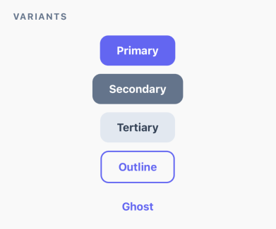
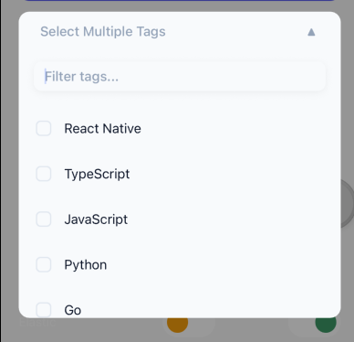
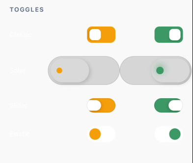
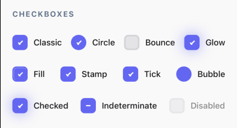
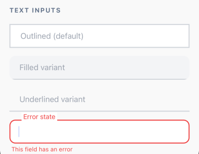

# 🔘 rn-pressy

**The UI library that feels _too good_ to use.**

Sick of boring-ass buttons that just sit there like your ex? Want components that actually have personality and go _boop_, _swish_, _zap_, and _pop_?

`rn-pressy` is a haptic-enabled, fully-loaded, slightly-unhinged UI component library for React Native that your design team will either love or report to HR.

It scales. It pulses. It glares like your code reviewer. It shakes when you mess up (just like you after that 4th coffee). It handles your dark mode trauma automatically because we've all been there at 3 AM.

**Was it needed?** Absolutely not.  
**Did I write the entire code myself?** Hell nah, credits to AI IDEs (they're taking our jobs but at least they're helpful).  
**Did I make it anyway?** Yes. I was bored. Now it's your problem (solution). 🤷‍♂️

**Will it get you promoted?** Probably not, but your buttons will look fire. 🔥

---

## 📦 What's Inside?

### 🔘 Pressy - The Button

The button that started it all. Haptic feedback, animations, swipe-to-confirm, liquid glass effect (iOS 18+), and more chaos than you asked for. It's like a regular button went to therapy, got confident, and now won't shut up about its glow-up.

**NEW:** iOS 18+ liquid glass effect support! That premium frosted glass look Apple loves. 🧊

[📖 Full Pressy Documentation](./src/Pressy/README.md)



### 🎨 DDown - The Dropdown

Seamless dropdowns that extend from the button like magic. No gaps, perfect alignment, and smooth as butter. Your other dropdowns could never. They're literally shaking rn.

[📖 Full DDown Documentation](./src/DDown/README.md)



### 🎚️ Toggy - The Toggle

Smooth toggles with multiple variants. Classic, Solar, Slider, Elastic - pick your poison. Each one smoother than your pickup lines (which isn't saying much, but still).



### ☑️ Chex - The Checkbox

Checkboxes that don't suck. Multiple variants, smooth animations, and actually fun to click. Yes, we made checkboxes fun. No, we don't need therapy (maybe a little).



### 📝 Inpy - The Text Input

Text inputs with style. Outlined, filled, underlined - all the variants you need. Finally, inputs that don't look like they're from a 2008 PHP tutorial.



---

## 📚 Documentation

**[📖 Complete Documentation](./DOCS.md)** - Theming, accessibility, migration, and advanced examples

Quick links:

- **[🤖 MCP Server Guide](./mcp-server/README.md)** - AI assistant integration
- **[🎨 DDown Component](./src/DDown/README.md)** - Dropdown documentation
- **[🔘 Pressy Component](./src/Pressy/README.md)** - Button documentation

---

## 🚀 Installation

Stop stalling. Get the goods. Your buttons aren't gonna press themselves.

```sh
npm install rn-pressy
# or
yarn add rn-pressy
# or if you're fancy
pnpm add rn-pressy
```

### Peer Dependencies

For the Chex component (checkboxes with SVG animations that'll make your designer cry tears of joy), you'll also need:

```sh
npm install react-native-svg
# or
yarn add react-native-svg
```

**Pro tip:** If you skip this, the checkboxes will judge you silently.

### Optional: Liquid Glass Effect (iOS 18+)

Want that premium frosted glass effect on iOS? Install the optional liquid glass package:

```sh
npm install @callstack/liquid-glass
# or
yarn add @callstack/liquid-glass

# iOS only - run pod install
cd ios && pod install
```

**Requirements:**

- iOS 18+ (falls back gracefully on older versions)
- Xcode 16+
- React Native 0.80+
- Not supported in Expo Go (use dev builds)

**Usage:**

```tsx
<Pressy
  title="Frosted Vibes"
  liquidGlass
  liquidGlassEffect="clear"
  onPress={() => {}}
/>
```

---

## 🤖 AI Integration (MCP Server)

Want AI to do your job for you? (Don't we all?) We've got an MCP (Model Context Protocol) server that gives AI assistants full access to component docs, props, and examples. It's like having a junior dev who actually reads the documentation.

### Quick Setup

Add to your MCP config (e.g., `~/.kiro/settings/mcp.json` or Claude Desktop config):

```json
{
  "mcpServers": {
    "rn-pressy": {
      "command": "node",
      "args": ["/path/to/rn-pressy/mcp-server/index.js"]
    }
  }
}
```

Now AI assistants can:

- Answer questions about components (better than Stack Overflow)
- Generate code examples (that actually work)
- Compare variants (so you don't have to)
- Search features (faster than Ctrl+F)
- Provide prop references (no more guessing)

Basically, it's like pair programming but the AI doesn't eat your snacks.

[📖 Full MCP Server Documentation](./mcp-server/README.md)

---

## 📚 The Prop Bible

Everything you can throw at this button. Read it. Memorize it. Become one with the button. Transcend.

### 🎨 Content & Presets

| Prop        | Type                                                   | Default   | Vibe Check                                                      |
| :---------- | :----------------------------------------------------- | :-------- | :-------------------------------------------------------------- |
| `title`     | `string`                                               | `-`       | What the button says. Keep it short, this ain't your memoir.    |
| `children`  | `ReactNode`                                            | `-`       | If you think you're too cool for `title`. (You probably are.)   |
| `variant`   | `primary`, `secondary`, `tertiary`, `outline`, `ghost` | `primary` | The fit check. Choose your fighter. `ghost` is for introverts.  |
| `shape`     | `rounded`, `pill`, `circle`, `square`                  | `rounded` | Shape up or ship out. `circle` is goated for icons. Facts.      |
| `size`      | `xs`, `sm`, `md`, `lg`, `xl`                           | `md`      | Size matters. (For accessibility, get your mind out the gutter) |
| `shadow`    | `none`, `sm`, `md`, `lg`                               | `none`    | Drop it like it's hot. Shadow daddy energy.                     |
| `colors`    | `Partial<PressyColors>`                                | `-`       | Override the drip manually. Be the designer you wish to see.    |
| `themeMode` | `light`, `dark`, `auto`                                | `auto`    | Force the mood. We support your emotional journey.              |

### ⚡ Actions & Gestures

| Prop               | Type              | Default | Vibe Check                                               |
| :----------------- | :---------------- | :------ | :------------------------------------------------------- |
| `onPress`          | `(event) => void` | `-`     | The clicky bit. The whole point. The reason we're here.  |
| `onLongPress`      | `(event) => void` | `-`     | Hold it... hold it... NOW! (That's what she said.)       |
| `delayLongPress`   | `number`          | `500`   | How patient are you? (ms) Spoiler: not very.             |
| `onDoublePress`    | `() => void`      | `-`     | Double tap like Instagram. Heart react your own buttons. |
| `doublePressDelay` | `number`          | `300`   | Speedrun strats. Gotta go fast.                          |

### 🎭 Animations & Effects

| Prop             | Type                                  | Default | Vibe Check                                                          |
| :--------------- | :------------------------------------ | :------ | :------------------------------------------------------------------ |
| `pulse`          | `boolean`                             | `false` | Heartbeat mode. For when your button needs therapy.                 |
| `pulseSpeed`     | `number`                              | `1500`  | How fast is its heart racing? Anxiety levels: adjustable.           |
| `glare`          | `boolean`                             | `false` | That premium credit card shine. ✨ Flexing on the other buttons.    |
| `glow`           | `boolean`                             | `false` | Radioactive aura. Chernobyl chic. Glowing personality.              |
| `vibration`      | `boolean`, `light`, `medium`, `heavy` | `-`     | Bzzzt. Haptics make everything better. Science fact.                |
| `animationSpeed` | `number`                              | `20`    | How snappy the press feels. Lower = Snappier. We like it snappy. 😏 |

### ✅ Success & Error States (The Big Brain Stuff)

Stop writing `if (success) { color: green }` like it's 2015. We do that for you because we're not savages.

| Prop            | Type      | Description                                                               |
| :-------------- | :-------- | :------------------------------------------------------------------------ |
| `isSuccess`     | `boolean` | Keeps it 💯. Button turns Green + Glare. Victory lap mode activated.      |
| `successConfig` | `object`  | Customize the W. `{ animation: 'glare', colors: {...} }` Flex on 'em.     |
| `isError`       | `boolean` | You messed up. Button turns Red + Shakes. Shame mode. Walk of shame mode. |
| `errorConfig`   | `object`  | Customize the L. `{ shake: true, colors: {...} }` Own your mistakes.      |

### 🕵️ Swipe & Reveal (The Commitment Issues Section)

| Prop              | Type            | Default | Vibe Check                                                               |
| :---------------- | :-------------- | :------ | :----------------------------------------------------------------------- |
| `revealToPress`   | `boolean`       | `false` | Tap once to see "Are you sure?", tap again to regret it. Trust issues++. |
| `swipeable`       | `boolean`       | `false` | Slide into the DMs (or delete them). Swipe right for destruction.        |
| `swipeDirection`  | `left`, `right` | `right` | Which way we sliding? Left is for quitters.                              |
| `onSwipeComplete` | `() => void`    | `-`     | Done deal. No take-backsies. You swiped, you committed.                  |

---

## 🎮 Quick Start Examples

### Pressy - The "I Just Need a Damn Button"

```tsx
import { Pressy } from 'rn-pressy';

<Pressy
  title="Press Me"
  variant="primary"
  onPress={() => console.log('Poggers')}
/>;

// That's it. You're done. Go touch grass.
```

### DDown - The "Seamless Dropdown"

```tsx
import { DDown } from 'rn-pressy';

<DDown
  options={[
    { label: 'Apple', value: 'apple', icon: <Text>🍎</Text> },
    { label: 'Banana', value: 'banana', icon: <Text>🍌</Text> },
  ]}
  value={value}
  onChange={setValue}
  placeholder="Select a fruit"
  searchable
/>;
```

### Toggy - The "Smooth Toggle"

```tsx
import { Toggy } from 'rn-pressy';

<Toggy
  value={isEnabled}
  onValueChange={setIsEnabled}
  variant="solar"
  activeColor="#3b82f6"
/>;
```

### Chex - The "Fun Checkbox"

```tsx
import { Chex } from 'rn-pressy';

<Chex
  checked={isChecked}
  onValueChange={setIsChecked}
  label="I agree to the terms"
  variant="bounce"
/>;
```

### Inpy - The "Styled Input"

```tsx
import { Inpy } from 'rn-pressy';

<Inpy
  value={text}
  onChangeText={setText}
  label="Email"
  variant="outlined"
  clearable
/>;
```

---

## 🎨 Advanced Examples

### The "I Just Need a Damn Button" (Minimalist Era)

```tsx
import { Pressy } from 'rn-pressy';

<Pressy
  title="Press Me"
  variant="primary"
  onPress={() => console.log('Poggers')}
/>;

// Clean. Simple. Chef's kiss. 👨‍🍳💋
```

### The "Main Character Energy" (Use Responsibly)

```tsx
<Pressy
  title="DELETE PRODUCTION DB"
  variant="primary"
  colors={{ primary: '#ff0055' }}
  // The fun stuff (aka the "oh shit" button)
  pulse={true}
  glare={true}
  vibration="heavy"
  // Logic (what could go wrong?)
  isError={submissionFailed}
  errorConfig={{ shake: true }} // Wiggle of shame. You done goofed.
  onLongPress={() => destroyEverything()} // Your résumé update button
/>

// Note: Not responsible for career-ending decisions
// But the button will look fire while you make them 🔥
```

### The "Smart Button" (Actually Handles Your Shit)

```tsx
const [status, setStatus] = useState('idle');

<Pressy
  title={
    status === 'success' ? 'Sent!' : status === 'error' ? 'Retry?' : 'Submit'
  }
  isSuccess={status === 'success'}
  isError={status === 'error'}
  successConfig={{
    animation: 'glare',
    colors: { primary: '#22c55e' },
  }} // Green means go (brag)
  errorConfig={{
    shake: true,
    colors: { primary: '#ef4444' },
  }} // Red means dead (try again loser)
  onPress={handleSubmit}
/>;

// Look ma, no if statements! Just vibes and state management.
```

---

## 🎨 Theming (Make It Your Own, Bestie)

All components support automatic dark mode and custom theming through a centralized theme system. Because we're not monsters who hardcode colors like it's 2010.

### Quick Start (Literally 3 Lines)

```tsx
import { PressyProvider } from 'rn-pressy';

<PressyProvider mode="auto">
  <App />
</PressyProvider>;

// That's it. Dark mode? Handled. Light mode? Handled.
// Your existential crisis at 3 AM? Can't help with that one.
```

### Custom Theme Colors (Brand Guidelines Who?)

```tsx
<PressyProvider
  mode="dark"
  darkColors={{
    primary: '#ec4899', // Hot pink because we're not cowards
    primaryText: '#fff',
    secondary: '#8b5cf6', // Purple reign
  }}
>
  <App />
</PressyProvider>

// Your designer: "But the brand guidelines say—"
// You: "The brand guidelines didn't account for how fire this looks"
```

### Extend Themes

```tsx
import { extendTheme, lightTheme } from 'rn-pressy';

const brandTheme = extendTheme(lightTheme, {
  primary: '#ff6b6b',
  secondary: '#4ecdc4',
  brandAccent: '#ffe66d',
});

<PressyProvider customTheme={brandTheme}>
  <App />
</PressyProvider>;
```

### Use Theme Hook

```tsx
import { usePressyTheme } from 'rn-pressy';

function MyComponent() {
  const { theme, mode } = usePressyTheme();
  const isDark = mode === 'dark';

  return (
    <View style={{ backgroundColor: theme.colors.background }}>
      <Text style={{ color: theme.colors.text }}>Current mode: {mode}</Text>
    </View>
  );
}
```

**[📖 Complete Theming Guide](./DOCS.md#-theming)**

---

## 📱 Platform Support

- ✅ iOS (works like a charm, as expected)
- ✅ Android (works great, fight me)
- ✅ Web (works but haptics are a lie, sorry not sorry)

---

## ♿ Accessibility (We're Not Monsters)

All components are built with accessibility in mind, following WCAG 2.1 Level AA guidelines. Because making things accessible isn't optional, it's basic human decency wrapped in code.

### Accessibility Features

| Component  | Role        | Screen Reader | Keyboard           | Touch Target | States                            |
| ---------- | ----------- | ------------- | ------------------ | ------------ | --------------------------------- |
| **Pressy** | button      | ✅ Full       | Enter/Space        | 44x44pt      | disabled, loading, success, error |
| **DDown**  | button/menu | ✅ Full       | Arrows, Enter, Esc | Full area    | expanded, selected, disabled      |
| **Toggy**  | switch      | ✅ Full       | Space              | Full area    | checked, disabled                 |
| **Chex**   | checkbox    | ✅ Full       | Space              | 44x44pt      | checked, disabled                 |
| **Inpy**   | textbox     | ✅ Full       | Standard           | Full area    | focused, error, success, disabled |

### Usage Example

```tsx
<Pressy
  title="Submit Form"
  accessibilityLabel="Submit registration form"
  accessibilityHint="Double tap to submit your information"
  disabled={!isValid}
  onPress={handleSubmit}
/>
```

**[📖 Complete Accessibility Guide](./DOCS.md#-accessibility)**

---

## 🤝 Contributing

Found a bug? Want to add a "backflip" animation? Got a feature idea that's absolutely unhinged? PRs welcome.

**Rules:**

1. Keep it fun. No corpo-speak allowed.
2. If your PR includes the word "synergy," it's getting rejected.
3. Test your shit. We're chaotic, not reckless.
4. Comments are appreciated. Future you will thank present you.

## 📄 License

MIT. Go wild. Make it rain buttons. Build the next unicorn. Just don't sue us if your buttons are too fire and your app goes viral.

---

**Made with ❤️, ☕, and questionable life choices.**

_P.S. - If this library helped you ship faster, consider starring the repo. It's free and makes us feel good about our life decisions._
