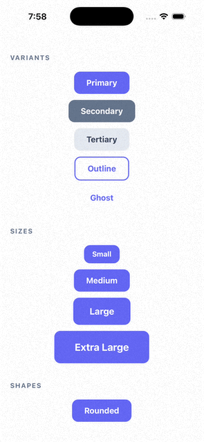

# 🎯 Pressy - The Button That Slaps

**When a regular button just doesn't hit different.**

Look, we've all been there. You're building an app, you need a button, and suddenly you're 3 hours deep into CSS hell trying to make it not look like it's from 2012. This button said "nah, I got you fam."

It scales. It pulses. It literally shakes when you mess up (like your hands after too much coffee). It even goes _bzzzt_ if you're into that.

**Did anyone ask for this?** No.  
**Did the world need another button library?** Absolutely not.  
**Am I gonna use it anyway?** You're damn right. 😤

<!-- Add demo image/gif here -->



---

## ✨ What Makes This Button Not Mid?

### 🎨 **Visual Variants** (The Drip)

- **Primary** - Main character energy
- **Secondary** - Supporting cast but still important
- **Tertiary** - Background character that's actually useful
- **Outline** - Minimalist flex
- **Ghost** - Invisible until you need it (like your dad)

### 📏 **Size Presets** (Size Does Matter)

- **SM** - Smol bean energy (it's not the size, it's how you use it... jk it matters)
- **MD** - Goldilocks zone (default, average, perfectly adequate)
- **LG** - Chonky boi (now we're talking)
- **XL** - Absolute unit (compensating for something? No judgment)

### 🔷 **Shape Options** (Get In Formation)

- **Rounded** - Soft boi (default, safe choice)
- **Pill** - Tic-tac mode activated (long and smooth)
- **Circle** - Perfect for that one icon (round and firm)
- **Square** - Edgy. Literally. (sharp corners, handle with care)

### 🌑 **Shadow Levels** (The Depth)

- **None** - Flat as your ex's personality
- **SM** - Subtle flex
- **MD** - Notice me senpai
- **LG** - LOOK AT ME I'M FLOATING

### 🎭 **States & Feedback** (The Feels)

- **Loading** - Spinny boi doing work
- **Success** - Green = good, dopamine = released
- **Error** - Red + shake = you done goofed
- **Disabled** - Can't touch this (dun dun dun dun)

### 🎪 **Advanced Interactions** (The Party Tricks)

- **Long Press** - Hold it like you hold grudges (or your partner's hand)
- **Double Tap** - Instagram trained you for this (double tap if you'd smash)
- **Swipeable** - Slide into confirmation (like sliding into DMs)
- **Reveal-to-Press** - "Are you sure?" but make it ✨fancy✨ (foreplay for buttons)
- **Haptic Feedback** - Goes brrr (light/medium/heavy, like your preferences)

### ✨ **Animation Effects** (The Sauce)

- **Pulse** - Heartbeat of a button having an anxiety attack (or arousal, we don't judge)
- **Glare** - That premium credit card shine ✨ (slippery when wet)
- **Glow** - Radioactive vibes (glowing like you after a good time)
- **Shake** - Error wiggle of shame (the walk of shame, but for buttons)
- **Custom Scale** - Make it bounce however you want (size adjustable, performance guaranteed)

### 🎨 **Theming** (The Aesthetic)

- **Auto Dark Mode** - Respects your 3am coding sessions
- **Custom Colors** - Make it match your vibe
- **Theme Provider** - One theme to rule them all

---

## 📖 Basic Usage (The Bare Minimum)

```tsx
import { Pressy } from 'rn-pressy';

function MyComponent() {
  return <Pressy title="Press Me" onPress={() => console.log('Pressed!')} />;
}
```

Congrats, you made a button. Your parents are so proud. 🎉

---

## 🎯 Examples (The Good Stuff)

### Variants (Choose Your Fighter)

<!-- Add variants image here -->


```tsx
<Pressy title="Primary" variant="primary" onPress={() => {}} />
<Pressy title="Secondary" variant="secondary" onPress={() => {}} />
<Pressy title="Tertiary" variant="tertiary" onPress={() => {}} />
<Pressy title="Outline" variant="outline" onPress={() => {}} />
<Pressy title="Ghost" variant="ghost" onPress={() => {}} />
```

### Sizes (From Smol to Chonk)

<!-- Add sizes image here -->


```tsx
<Pressy title="Small" size="sm" onPress={() => {}} />
<Pressy title="Medium" size="md" onPress={() => {}} />
<Pressy title="Large" size="lg" onPress={() => {}} />
<Pressy title="Extra Large" size="xl" onPress={() => {}} />
```

### Shapes (Geometry Class Flashbacks)

<!-- Add shapes image here -->


```tsx
<Pressy title="Rounded" shape="rounded" onPress={() => {}} />
<Pressy title="Pill" shape="pill" onPress={() => {}} />
<Pressy
  icon={<Text>+</Text>}
  shape="circle"
  onPress={() => {}}
/>
<Pressy
  icon={<Text>■</Text>}
  shape="square"
  onPress={() => {}}
/>
```

### Shadows (The Levitation Act)

<!-- Add shadows image here -->


```tsx
<Pressy title="No Shadow" shadow="none" onPress={() => {}} />
<Pressy title="Small Shadow" shadow="sm" onPress={() => {}} />
<Pressy title="Medium Shadow" shadow="md" onPress={() => {}} />
<Pressy title="Large Shadow" shadow="lg" onPress={() => {}} />
```

### With Icons (Emoji Game Strong)

<!-- Add icons image here -->


```tsx
import Icon from 'react-native-vector-icons/Ionicons';

<Pressy
  title="Icon Left"
  icon={<Icon name="heart" size={20} color="#fff" />}
  onPress={() => {}}
/>

<Pressy
  title="Icon Right"
  icon={<Icon name="arrow-forward" size={20} color="#fff" />}
  iconPosition="right"
  onPress={() => {}}
/>

<Pressy
  title="Emoji 🚀"
  icon={<Text>🚀</Text>}
  onPress={() => {}}
/>
```

### Loading State (Spinny Boi Hours)

<!-- Add loading image here -->


```tsx
<Pressy
  title="Loading..."
  isLoading
  onPress={() => {}}
/>

// Custom loader because you're fancy like that
<Pressy
  title="Custom Loader"
  isLoading
  loader={<ActivityIndicator color="#fff" size="small" />}
  onPress={() => {}}
/>
```

### Success & Error States (The Emotional Rollercoaster)

<!-- Add states image here -->


```tsx
const [status, setStatus] = useState<'idle' | 'success' | 'error'>('idle');

<Pressy
  title={
    status === 'success'
      ? 'Success!'
      : status === 'error'
      ? 'Try Again'
      : 'Submit'
  }
  onPress={handleSubmit}
  isSuccess={status === 'success'}
  isError={status === 'error'}
  successConfig={{
    colors: { primary: '#22c55e', primaryText: '#fff' },
    animation: 'glare', // ✨ Sparkle sparkle ✨
  }}
  errorConfig={{
    colors: { primary: '#ef4444', primaryText: '#fff' },
    shake: true, // Wiggle of shame
  }}
/>;
```

### Haptic Feedback (The Brrr Factor)

```tsx
<Pressy
  title="Light Haptic"
  vibration="light"
  onPress={() => {}}
  // Gentle touch
/>

<Pressy
  title="Medium Haptic"
  vibration="medium"
  onPress={() => {}}
  // Just right
/>

<Pressy
  title="Heavy Haptic"
  vibration="heavy"
  onPress={() => {}}
  // Warning: May cause phone to achieve sentience (or orgasm, whichever comes first)
/>
```

### Long Press & Double Tap (The Combo Moves)

```tsx
<Pressy
  title="Long Press Me"
  onPress={() => console.log('Short press')}
  onLongPress={() => console.log('Long press!')}
  delayLongPress={500}
  // Like holding a grudge, but productive (or holding... other things)
/>

<Pressy
  title="Double Tap Me"
  onDoublePress={() => console.log('Double tapped!')}
  doublePressDelay={300}
  // Instagram trained you for this moment (double tap if you'd hit it)
/>
```

### Swipeable (Slide Into Confirmation)

<!-- Add swipeable gif here -->


```tsx
<Pressy
  title="Swipe Right to Confirm →"
  swipeable
  swipeDirection="right"
  onSwipeComplete={() => console.log('Confirmed!')}
  style={{ width: '100%' }}
  // Like Tinder, but for deleting your production database
  // Swipe right if you're ready to commit (to the action, not a relationship)
/>
```

### Reveal-to-Press (The "Are You Sure?" But Fancy)

<!-- Add reveal gif here -->


```tsx
<Pressy
  title="Tap to Reveal"
  variant="outline"
  revealToPress
  revealContent={
    <Text style={{ color: '#22c55e', fontWeight: '700' }}>
      Confirm? Tap Again
    </Text>
  }
  onReveal={() => console.log('Revealed!')}
  onPress={() => console.log('Confirmed!')}
  revealTimeout={3000}
  // Two-step verification for commitment-phobes
  // Like asking "are you sure?" but sexier
/>
```

### Animation Effects (The Eye Candy)

<!-- Add effects gif here -->


```tsx
// Pulse Effect (Anxiety Mode)
<Pressy
  title="Pulse Effect"
  pulse
  pulseSpeed={1500}
  pulseIntensity={1.05}
  onPress={() => {}}
  // Heartbeat of a button having an existential crisis
/>

// Glare Effect (Premium Vibes)
<Pressy
  title="Glare Effect"
  glare
  glareSpeed={2000}
  onPress={() => {}}
  // That credit card shine ✨
/>

// Glow Effect (Radioactive)
<Pressy
  title="Glow Effect"
  glow
  glowColor="#6366f1"
  glowSpeed={1500}
  onPress={() => {}}
  // Chernobyl aesthetic
/>

// Shake (The Wiggle of Shame)
const buttonRef = useRef<PressyRef>(null);

<Pressy
  ref={buttonRef}
  title="Shake on Error"
  onPress={() => buttonRef.current?.shake()}
  // *Wiggle wiggle wiggle*
/>
```

### Custom Animation (Make It Yours)

```tsx
<Pressy
  title="Subtle Press"
  scaleValue={0.98}
  opacityValue={0.9}
  animationSpeed={30}
  onPress={() => {}}
  // For the minimalists
/>

<Pressy
  title="Bouncy Press"
  scaleValue={0.9}
  opacityValue={0.6}
  animationSpeed={10}
  onPress={() => {}}
  // BOING BOING BOING
/>
```

### Custom Colors (Match Your Vibe)

```tsx
<Pressy
  title="Custom Primary"
  colors={{ primary: '#ec4899', primaryText: '#fff' }}
  onPress={() => {}}
  // Hot pink because why not
/>

<Pressy
  title="Custom Outline"
  variant="outline"
  colors={{ outlineBorder: '#22c55e', outlineText: '#22c55e' }}
  onPress={() => {}}
  // Green outline for that eco-friendly flex
/>
```

### Disabled State (Can't Touch This)

```tsx
<Pressy
  title="Disabled"
  disabled
  onPress={() => {}}
  // Like your motivation on Monday morning
/>

<Pressy
  title="Custom Disabled Opacity"
  disabled
  disabledOpacity={0.3}
  onPress={() => {}}
  // Extra faded, like your will to live
/>
```

---

## 🎛️ Props Reference (The Whole Menu)

Too many props to list here without making this README longer than your ex's list of complaints.

Check the TypeScript definitions or just use autocomplete like a normal person. Your IDE knows what's up.

**TL;DR**: It has props for literally everything. Variants, sizes, shapes, shadows, animations, gestures, haptics, theming, and probably your zodiac sign.

---

## 🎨 Theming (Match Your Vibe)

### Using PressyProvider (The Global Drip)

```tsx
import { PressyProvider } from 'rn-pressy';

<PressyProvider mode="auto">
  <App />
</PressyProvider>;
```

### Custom Colors (Make It Yours)

```tsx
<PressyProvider
  mode="dark"
  darkColors={{
    primary: '#ec4899',
    primaryText: '#fff',
  }}
>
  <App />
</PressyProvider>
```

---

## 🎯 Imperative Methods (The Cheat Codes)

```tsx
import { useRef } from 'react';
import type { PressyRef } from 'rn-pressy';

const buttonRef = useRef<PressyRef>(null);

// Make it shake on command
buttonRef.current?.shake();
// *Wiggle wiggle*
```

---

## ♿ Accessibility (We're Not Monsters)

The component includes:

- Proper accessibility roles (screen readers won't hate you)
- State announcements (tells users what's up)
- Keyboard navigation (for the keyboard warriors)
- Screen reader compatibility (blind homies welcome)
- High contrast support (for the light-sensitive vampires)

---

## 📱 Platform Support (Where It Works)

- ✅ iOS (works like a charm)
- ✅ Android (also works like a charm)
- ✅ Web (works but haptics are mid)

---

## 🎭 Best Practices (Don't Be That Person)

1. **Use appropriate variants** - Primary for main actions, not everything
2. **Don't overuse effects** - Pulse, glare, and glow are like hot sauce. A little goes a long way
3. **Provide haptic feedback** - Makes it feel premium af
4. **Use loading states** - Don't leave users hanging
5. **Consider accessibility** - Not everyone can see your fancy animations
6. **Test on devices** - Shadows look different on real hardware

---

## 🤝 Contributing

Found a bug? Want to add a backflip animation? PRs welcome.  
Just keep it fun. No corpo-speak allowed. We're here for a good time, not a long time.

---

## 📄 License

MIT - Do whatever you want with it. Make it rain buttons. I don't care. Just don't sue me if your app becomes sentient.
